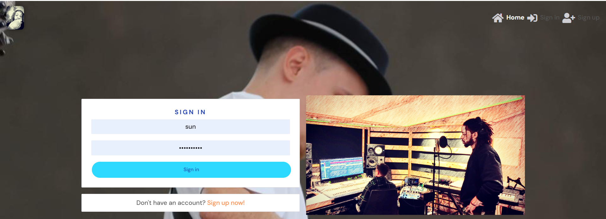
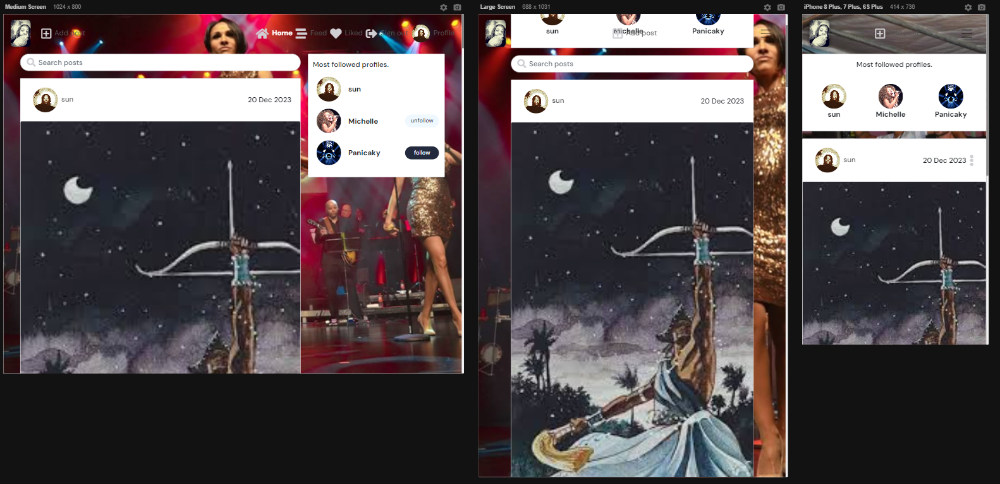

Soul Carnival is your go-to platform for musicians to share their creative journey and connect with a vibrant community of like-minded artists. Whether you're a seasoned musician, an emerging talent, or just passionate about music, Soul Carnival provides a space to showcase your artistry. Share your musical creations, from soulful melodies to energetic beats, accompanied by the stories and inspiration behind each piece.

Engage with fellow musicians, discover new sounds, and build meaningful connections within the Soul Carnival community. Whether you're into collaborative projects, seeking feedback on your latest track, or simply connecting with other music enthusiasts, Soul Carnival is the place to be.

Stay tuned for exciting updates as we evolve our platform to include features like messaging, video uploads, and an about landing page, introducing the community and upcoming events. The stage is set for a musical journey filled with creativity, camaraderie, and endless inspiration.

Join Soul Carnival today and let the rhythm of connection and collaboration amplify your musical experience.

# Responsiveness Mock-up

Developer: [Roger Davis](https://github.com/RogerWDavis)  
[Live webapp](https://duggiezb-7eefa269f2cf.herokuapp.com/)  
[Repository](https://github.com/RogerWDavis/duggiez-backend)  
[APi](https://travel-tickr-api-e57198555b47.herokuapp.com/)  
[API Repository](https://github.com/SandraBergstrom/travel-tickr-api)  

## Table of Content

- [User Experience](#user-experience)
  * [Objective:](#objective-)
  * [Strategy](#strategy)
    + [Project Goals](#project-goals)
    + [User Goals](#user-goals)
    + [Site Owner Goals](#site-owner-goals)
    + [Target Audience](#target-audience)
    + [User Requirements and Expectations](#user-requirements-and-expectations)
  * [Scope](#scope)
    + [Features](#features)
    + [Future Features](#future-features)
    + [User Stories](#user-stories)
  * [Structure](#structure)
    + [Database](#database)
  * [Component Architecture and Reusability](#component-architecture-and-reusability)
    + [Core Components](#core-components)
    + [Component Pages](#component-pages)
    + [Component relation to User Story](#component-relation-to-user-story)
  * [Skeleton](#skeleton)
    + [Wireframes](#wireframes)
  * [Surface](#surface)
    + [Design Choices](#design-choices)
    + [Colour](#colour)
    + [Typography](#typography)
- [Technologies Used](#technologies-used)
  * [Languages](#languages)
  * [Frameworks.](#frameworks)
  * [Database](#database-1)
  * [Tools](#tools)
  * [Supporting Libraries and Packages](#supporting-libraries-and-packages)
- [Methodology](#methodology)
  * [Agile Project Management with GitHub Projects](#agile-project-management-with-github-projects)
  * [User Stories as GitHub Issues](#user-stories-as-github-issues)
  * [Commit and Issue Linking](#commit-and-issue-linking)
  * [Bug Tracking](#bug-tracking)
  * [Iterative Development Approach](#iterative-development-approach)
    + [Sprint 1 (June 13th - June 18th, 2023):](#sprint-1--june-13th---june-18th--2023--)
    + [Sprint 2 (June 19th - June 24th, 2023):](#sprint-2--june-19th---june-24th--2023--)
    + [Sprint 3 (June 25th - July 1st, 2023):](#sprint-3--june-25th---july-1st--2023--)
    + [Sprint 4 (July 2nd - July 7th, 2023):](#sprint-4--july-2nd---july-7th--2023--)
    + [Backlog](#backlog)
  * [Backlog and Subsequent Iterations](#backlog-and-subsequent-iterations)
- [Bugs](#bugs) 
- [Testing](#testing)
- [Deployment](#deployment)
- [Credits](#credits)
- [Acknowledgements](#acknowledgements)

## User Experience
The Soul Carneval platform is designed to cater to a diverse range of users who share a common interest in music and community. 

### Objective:
The objective of Soul Carneval is to create a community platform that caters to the needs and expectations of music enthusiasts.

### Strategy

#### Project Goals 

- **Create a music community Platform:** Develop a user-friendly web application that allows travelers to save and share their content in the form of text and pictures. Provide a seamless experience for users to upload content, comment on others content. Enable users to create, read, comment, and like others contents. 
  Mapped to User Story: [14,](https://github.com/SandraBergstrom/travel-tickr/issues/14) [15,](https://github.com/SandraBergstrom/travel-tickr/issues/15) [16,](https://github.com/SandraBergstrom/travel-tickr/issues/16) [17](https://github.com/SandraBergstrom/travel-tickr/issues/17)

- **Build a music Community:** Foster a vibrant community of musicians by enabling users to connect with each other, follow fellow music lovers, and like and comment on their content. 
  Mapped to User Story: [18,](https://github.com/SandraBergstrom/travel-tickr/issues/18) [19,](https://github.com/SandraBergstrom/travel-tickr/issues/19) [20,](https://github.com/SandraBergstrom/travel-tickr/issues/20) [21,](https://github.com/SandraBergstrom/travel-tickr/issues/21) [23,](https://github.com/SandraBergstrom/travel-tickr/issues/23) [24,](https://github.com/SandraBergstrom/travel-tickr/issues/24) [25,](https://github.com/SandraBergstrom/travel-tickr/issues/25) [50,](https://github.com/SandraBergstrom/travel-tickr/issues/50) [51,](https://github.com/SandraBergstrom/travel-tickr/issues/51) [61](https://github.com/SandraBergstrom/travel-tickr/issues/61)
  
- **Offer Seamless Travel Exploration:** Implement features that enhance the travel exploration process, such as enable travelers to search and filter content based on username, popularity, date created, title, content keywords, and category. Provide search functionality that allows users to easily find relevant content and resources. 
  Mapped to User Story: [18,](https://github.com/SandraBergstrom/travel-tickr/issues/18) [19](https://github.com/SandraBergstrom/travel-tickr/issues/19) [27,](https://github.com/SandraBergstrom/travel-tickr/issues/27) [36](https://github.com/SandraBergstrom/travel-tickr/issues/36)

- **Provide a Clean and Intuitive User Interface:** Design an aesthetically pleasing and user-friendly interface. Ensure the application meets accessibility guidelines, follows UX design principles, and provides a set of user interactions that intuitively guide users through the platform. Implement responsive design to ensure the application is accessible and functional across different devices. 
  Mapped to all user stories.
  
- **Implement Advanced Features *(if time permits)*:** Explore the possibility of implementing additional features, such as direct messaging, audio and video upload, an about page with an event schedule and a blog page. 
  Mapped to User Story: [28,](https://github.com/SandraBergstrom/travel-tickr/issues/28) [29,](https://github.com/SandraBergstrom/travel-tickr/issues/29) [30,](https://github.com/SandraBergstrom/travel-tickr/issues/30) [31,](https://github.com/SandraBergstrom/travel-tickr/issues/31) [32](https://github.com/SandraBergstrom/travel-tickr/issues/32)

  #### User Goals
- **Capture and share music related content:** Users want to share and preserve their musical experiences in a secure and organized manner.

- **Discuss Content:** Users aim to share share how they have been impacted by each others content.

- **Discover New Music:** Users are interested in exploring new content and discovering recommendations and tips shared by other community members.

- **Connect with Fellow Musicians:** Users want to connect with like-minded people, follow their journeys, and engage in meaningful interactions.

- **Access a User-Friendly Platform:** Users expect a user-friendly and intuitive platform that is easy to navigate, provides a seamless uploading and sharing experience, and offers search and filter functionalities for finding relevant content.

#### Site Owner Goals
- **Create a Vibrant Music Community:** The site owner aims to establish a vibrant community of musicians who actively engage, connect, and share their content.

- **Facilitate Content Sharing:** The site owner intends to provide a platform where users can easily upload,  and share their music related content, fostering a culture of community and inspiration.

- **Drive User Engagement:** The site owner wants to encourage user engagement by implementing features such as likes, comments, and following functionalities, creating an interactive and supportive community.

- **Enhance User Experience:** The site owner strives to deliver a seamless and enjoyable user experience through an aesthetically pleasing design, intuitive navigation, and responsive interface across devices.

- **Promote Marketing Opportunities:** The site owner aims to facilitate the development of a community by facilitating content share and visibility.

- **Monetization Opportunities:** The site owner may seek monetization opportunities through partnerships, advertising, or premium features, while ensuring they align with the overall user experience and add value to the community.

#### User Requirements and Expectations
To meet the needs and expectations of the target audience, the music community platform should fulfill the following requirements:

- **User-Friendly Interface:** Users expect an intuitive and easy-to-navigate interface that allows them to quickly access features and functionalities.

- **Seamless Content Creation:** Users require a smooth and streamlined process for uploading photos and writing accompanying comments.

- **Social Interaction:** Users expect the ability to connect with other travelers, follow their journeys, like and comment on their content.

-  **Discoverability and Search:** Users want to easily search and discover profiles and posts.

- **Responsive Design:** Users anticipate a responsive design that adapts to different devices (e.g., desktop, tablet, mobile) for seamless access and functionality.

By considering these user requirements and expectations, Soul Carneval can provide a positive and fulfilling user experience, encouraging user engagement, and fostering a vibrant community of musicians.

### Scope
#### Features

##### User Account Management
- Registration: Users can register for an account on the Travel Tickr platform to explore and share their travel memories.
- Login: Users can log in to their Travel Tickr account using their registered email and password to access personalized features.
- Logout: Users can securely log out of their Travel Tickr account to protect their account and maintain privacy.
- Profile Update: Users can update their profile information to reflect their current preferences and interests.

##### Post Management
- Create Memory Post: Users can upload a photo with accompanying text to create a memory post and share their travel experiences with others.
- View Posts: Users can view and read posts shared by other users to explore and discover travel stories.
- Update Posts: Users can edit or add content to their own posts to make changes or additions to their shared content.
- Delete Posts: Users can remove their own posts that are no longer relevant or desired.

##### Interactions and Engagement
- Search: Users can search for specific posts or users to discover new travel stories and connect with like-minded travelers.
- Sorting: Users can sort posts based on criteria such as date, popularity, or relevance to find the most relevant and interesting content.
- Like Posts: Users can like posts shared by other users to show appreciation for inspiring content.
- Commenting: Users can comment on posts shared by other users to engage in discussions and interact with the travel community.
- View Comments: Users can view and read comments on posts to follow conversations and opinions shared by other users.
- Update Comments: Users can edit or correct their own comments to modify their shared opinions.
- Delete Comments: Users can remove their own comments to retract or remove their previous statements.
- Follow Users: Users can follow other users to stay updated on their travel journeys and experiences.
- Site Owner Administration: Account, Post, and Comment Management: Site owners can delete user accounts, posts, and comments to maintain a safe and high-quality user environment.

##### Navigation:

###### Universal Navigation:
There is a fixed prominent navigation bar at the top, offering accessible features across the platform.

###### Unauthenticated Users:
Unauthenticated users are presented with a clean, intuitive navigation bar comprising a logo and links to essential pages including 'Login', and 'Sign Up'.

###### Authenticated Users:
Upon successful login, the navigation bar adapts to include exclusive features tailored for authenticated users. The 'Login' and 'Sign Up' links are replaced with additional options, namely 'Feed', 'Liked', 'Logout', and a direct link to their profile page.

###### Authenticated and Current Users:
For authenticated users viewing their own posts, comments, and profile, an additional layer of interactivity is provided. The recognizable icon displaying three dots reveals a dropdown menu when interacted with. This menu presents options to update or delete the corresponding content, providing users with full control over their own contributions to the platform.

#### Future Features

- An about page explaining the Soul Carneval mission statement, usage and community guidelines.
- Users can upload audio and video files as well.
- Direct messaging so that users can interact.
- A blog page with current events.

#### User Stories

##### 1: As a site user, I can register for an account so as to access personalized features and contribute to the community.

##### 2: As a registered user, I can create a post so as to share images and content with the community.

##### 3: As a site user, I can follow other users so as to keep up with their posts and activities.

##### 4: As a site user, I can customize my profile so as to share information about myself with the community.

##### 5: As a site user, I can log out so as to secure my account on shared devices.

##### 6: As a site user, I can comment on posts so as to engage with the community.

##### 7: As a site user, I can like posts so as to show appreciation for content.

##### 8: As a site user, I can edit and delete my own posts so as to have control over my content.

##### 9: As a site user, I can view my own profile stats so as to track my contributions to the community.

##### 10: As a site user, I can search for posts so as to find specific content.

##### 11: As a site administrator, I can manage user accounts so as to maintain a secure and well-functioning community.